# Diagrama (BPMN → Mermaid)

```mermaid
flowchart LR

subgraph Pool_Cadastrar["Cadastrar Usuário Novo"]
  direction TB
  Activity_05wns0j["#02:<br/>Preencher 'cadastro'"]
  Activity_1mddr1n["#01:<br/>Preencher 'email'"]
  Event_1b9s3pe(("Visita<br/>'Página<br/>Inicial'"))
  Event_0cqio0n(["Página<br/>de Entrada<br/>(web, mobile ou PWA)"])
  Event_05ykoca(["Página de Cadastro"])
  Event_0k2w09n(["Click<br/>'Cadastrar'<br/>(btn)"])
  Event_1ml3ih4(["cadastro<br/>(form)"])
  Event_0edo3c1(["Click<br/>'Próximo'<br/>(btn)"])
  Event_0fgwehf(["email<br/>(form)"])
  Event_118fwso(["Click<br/>'Comece<br/>Agora'<br/>(btn)"])
  Activity_08kmaxu["Abrir tela de Cadastro"]
  Activity_1gtoa9b["Validar Email"]
  Activity_17ocipp["Atualizar 'email (form)' com 'email inválido'"]
  Gateway_16lqbz9{"Email<br/>válido?"}
  Activity_1449gyq["Enviar email para API"]
  Activity_01fdagr["Verificar se email existe"]
  Activity_1l9yc50["Substitui componente 'email (form)' por 'cadastro (form)'" ]
  Gateway_0vsuxkb{"Email existe no sistema?"}
  Event_1oaoj7s(("vai para<br/>#01"))
  Activity_0tkofoo["Atualizar componente 'email (form)' com email já existe'"]
  Activity_1tiigzb["Validar dados de cadastro"]
  Activity_1qsbbdq["Atualizar comp. 'cadastro (form)' com estilo 'cadastro inválido'"]
  Gateway_1g2nwak{"Cadastro<br/>válido?"}
  Activity_0sp9poc["Enviar cadastro para API"]
  Activity_13bcne3["Salvar novo usuário"]
  Event_0c0a2lq(["Resposta<br/>da API"])
  Activity_1yjeltw["Salvar cadastro no dispositivo local."]
  Gateway_10uv8hn{"Sucesso no cadastro?"}
  Event_0w34rda(("Abrir Página de Login<br/>(end service)"))
  Activity_1tlwwlb["notifica e trata o caso"]
  Event_0isa8u1(("vai para<br/>#02"))

  Activity_1l9yc50 --> Activity_05wns0j
  Activity_05wns0j --> Event_1ml3ih4
  Activity_08kmaxu --> Activity_1mddr1n
  Activity_1mddr1n --> Event_05ykoca
  Event_1b9s3pe --> Event_0cqio0n
  Event_0cqio0n --> Event_118fwso
  Event_05ykoca --> Event_0fgwehf
  Event_1ml3ih4 --> Event_0k2w09n
  Event_0k2w09n --> Activity_1tiigzb
  Activity_1qsbbdq --> Event_1ml3ih4
  Event_118fwso --> Activity_08kmaxu
  Event_0fgwehf --> Activity_1gtoa9b
  Activity_1gtoa9b --> Gateway_16lqbz9
  Gateway_16lqbz9 -->|não| Activity_17ocipp
  Activity_17ocipp --> Event_0fgwehf
  Gateway_16lqbz9 -->|sim| Activity_1449gyq
  Activity_1449gyq --> Activity_01fdagr
  Activity_01fdagr --> Gateway_0vsuxkb
  Gateway_0vsuxkb -->|não| Activity_1l9yc50
  Gateway_0vsuxkb -->|sim| Activity_0tkofoo
  Activity_0tkofoo --> Event_1oaoj7s
  Activity_05wns0j --> Event_1ml3ih4
  Event_1ml3ih4 --> Event_0k2w09n
  Activity_1tiigzb --> Gateway_1g2nwak
  Gateway_1g2nwak -->|não| Activity_1qsbbdq
  Gateway_1g2nwak -->|sim| Activity_0sp9poc
  Activity_0sp9poc --> Activity_13bcne3
  Activity_13bcne3 --> Event_0c0a2lq
  Event_0c0a2lq --> Gateway_10uv8hn
  Gateway_10uv8hn -->|sim| Activity_1yjeltw
  Activity_1yjeltw --> Event_0w34rda
  Gateway_10uv8hn -->|não| Activity_1tlwwlb
  Activity_1tlwwlb --> Event_0isa8u1
  Event_0edo3c1 --> Activity_1gtoa9b
  Activity_1mddr1n --> Event_0edo3c1
end

subgraph Pool_Login["Login"]
  direction TB
  Event_0ypou7b(("Abre<br/>App"))
  Event_0alfn9o(["Tela<br/>de Entrada<br/>(web, mobile<br/>ou PWA)"])
  Event_0jagaeq(["Click<br/>'Login'<br/>(btn)"])
  Activity_0acnvrr["Atualizar login local"]
  Activity_1v6rmtp["Solicitar atualização de login"]
  Event_051ud9o(["resposta<br/>da API"])
  Gateway_0uio3ht{"Tem<br/>atualização?"}
  Activity_1if4juc["Abrir tela de Login"]
  Activity_07pk60e["Verificar se tem atualização de login"]
  Activity_1pguu4f["#1:<br/>Preencher login e senha"]
  Event_0huy29r(["Tela de<br/>Login"])
  Event_0hghev4(["login<br/>(form)"])
  Event_1kh1hly(["Click 'Entrar' (btn)"])
  Event_11s7f9s(("Abrir tela Inicial do App"))
  Gateway_0f4xcvn{"Login<br/>válido?"}
  Activity_03m6dha["Validar Login<br/>(local)"]
  Activity_14sbgs4["Resetar processo, atualizar 'login (form)' e vai para #1"]

  Activity_1if4juc --> Activity_1pguu4f
  Event_1kh1hly --> Activity_03m6dha
  Event_0jagaeq --> Activity_1v6rmtp
  Event_0ypou7b --> Event_0alfn9o
  Event_0alfn9o --> Event_0jagaeq
  Gateway_0uio3ht -->|não| Activity_1if4juc
  Activity_0acnvrr --> Activity_1if4juc
  Gateway_0uio3ht -->|sim| Activity_0acnvrr
  Activity_1v6rmtp --> Activity_07pk60e
  Event_051ud9o --> Gateway_0uio3ht
  Activity_07pk60e --> Event_051ud9o
  Activity_1pguu4f --> Event_0huy29r
  Event_0huy29r --> Event_0hghev4
  Event_0hghev4 --> Event_1kh1hly
  Activity_03m6dha --> Gateway_0f4xcvn
  Gateway_0f4xcvn -->|sim| Event_11s7f9s
  Gateway_0f4xcvn -->|não| Activity_14sbgs4
  Activity_14sbgs4 --> Activity_1pguu4f
end
```

> Observação: o arquivo BPMN possui dois *pools* ("Cadastrar Usuário Novo" e "Login") e não há *message flows* explícitos entre eles no XML; por isso, os fluxos aparecem separados, como no diagrama original.

